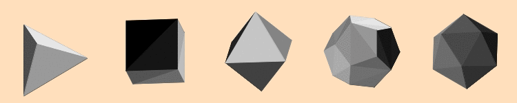

```{r setup, include=FALSE}
knitr::opts_chunk$set(echo = TRUE,
                      fig.path = "man/figures/")
devtools::load_all()
```

# Rdog 

This is a port of the [zdog](https://zzz.dog/) pseudo 3D engine for R.

Table of Contents
=================

   * [Rdog](#rdog-)
   * [Table of Contents](#table-of-contents)
      * [Installation](#installation)
      * [Why?](#why)
      * [Basic usage](#basic-usage)
      * [Rendering SVG paths](#rendering-svg-paths)
      * [Rendering 3D STL files](#rendering-stl-files)
      * [Rendering maps](#rendering-maps)
      * [Use in shiny](#use-in-shiny)
      * [Use as shiny inputs](#use-as-shiny-inputs)
      * [Anatomy of an animation](#anatomy-of-an-animation)
      * [Notes](#notes)
         * [Scoping](#scoping)
         * [Using colors](#using-colors)
      * [Todo](#todo)
      * [Rdog hex logo](#rdog-hex-logo)


## Installation

``` r
devtools::install_github('oganm/rdog')
```

Install the latest Rstudio to make sure it works well with the built in
viewer. Some elements appears to misbehave in older versions.

## Why?

As the zdog's author states

> Zdog is a 3D JavaScript engine for canvas and SVG. With Zdog, you can design and render simple 3D models on the Web. Zdog is a pseudo-3D engine. Its geometries exist in 3D space, but are rendered as flat shapes. This makes Zdog special.

Can rdog make renderings that look better than [rayshader](https://github.com/tylermorganwall/rayshader) or [rayrender](https://github.com/tylermorganwall/rayrender)? No. We have no perspective,
no distance blurring, no lighting simulation, no shadows. You have objects in a 3D space and they
tend to look cute with minimal effort. It has a nice natural aesthetic that I happen
to like.

One advantage is that output of rdog is an htmlwidget and the rendering is done through
javascript objects by the browser. Images are rendered into a canvas or an svg context.
This is particularly nice for shiny apps since 
rendering is outsourced to the users' browser and the rendered objects can be manipulated
with relative ease through javascript or wrapper functions provided in the package.

## Basic usage

Taking a look at the [zdog api](https://zzz.dog/api) will give you a good idea how
things work. Variable names and defaults are preserved. The only major difference
is the use of piping to create a single illustration object with all the elements.

An animated illustration can be created by adding elements to an illustration
using `%>%`. Each shape can be added to the illustartion itself (default), or
to another existing shape which will be used as a reference point. Here a box is
created placed on `y = -20`. The next element is an ellipse which is added to the 
box which places it in the middle of the box. All shape functions start with `shape`

To add text, a font should be added first. `zfont_font(id = 'font')` creates one
with the default font, "Roboto-Regular". Different fonts can be used if you have
the `ttf` files.

Finally, animations are also added to elements or the entire illustration. Here
`animation_rotate` is added to the ellipse and `animation_ease_in` is added to the
box which makes them rotate at different rates. `animation_none` will not move the
objects but creates the loop required for `dragRotate` to work.

``` {r cornell_box}
illustration('illo',width = 250,height = 250, dragRotate = TRUE) %>% 
    shape_box(id ='cornell',
              width = 150,
              height = 150,
              depth = 150,
              translate = c(y = '-20'),
              rotate = c(x = -tau/20,y = tau/16),
              stroke = 1,
              color = '#C25',
              leftFace = 'red',
              rightFace =  'darkgreen',
              topFace =  'white',
              bottomFace =  'white',
              frontFace =  FALSE,
              rearFace= 'lightgray') %>% 
    shape_ellipse(
        addTo = 'cornell',
        id = "ellipse",
        diameter = 80,
        stroke = 20,
        color = '#636',fill = FALSE
    ) %>% 
    zfont_font(id = 'font') %>% 
    zfont_text(zfont = 'font', text = 'Cornell Box',fontSize = 24,translate = c(y = 120),textAlign = 'center') %>% 
    animation_rotate(addTo = 'ellipse',id = 'rotate',rotate = c(y = 0.05)) %>% 
    animation_ease_in(id = 'ease',radiansPerCycle = tau/2,addTo='cornell',framesPerCycle = 200,power = 3) %>% 
    record_gif(duration = 10)
```


`record_gif` is not required for interactive usage or html renderings. By default, the
output is an htmlwidget, that can be automatically displayed in the viewer. This doesn't work
with github_document's due to restrictions on github so rendering into a gif or an image (`save_image`) is necesary.


`anchors` are invisible elements that one can add shapes to and be used as a reference point.

```{r anchor}
illustration('illo') %>% 
  anchor(id ='anchor', translate = c(x = 100)) %>% 
  shape_shape(addTo = 'anchor', translate = c(y = - 100), stroke = 20) %>% 
  save_image()
```

`copy` and `copy_graph` functions can be used to duplicate objects. `copy_graph`
 will also copy any children object that an object has. You can change properties
 of the object you copy by passing additional arguments.
 
```{r copy}
illustration('illo') %>% 
  shape_shape(id ='point1', translate = c(x = 100),stroke = 20, color = 'blue') %>% 
  shape_shape(addTo = 'point1', translate = c(y = - 100), stroke = 20, color = 'red') %>%
  copy(id = 'copyOfPoint1', what = 'point1',color = 'darkgreen',translate = c(x = -100)) %>%
  save_image()
```

```{r copyGraph}
illustration('illo') %>% 
  shape_shape(id ='point1', translate = c(x = 100),stroke = 20, color = 'blue') %>% 
  shape_shape(addTo = 'point1', translate = c(y = - 100), stroke = 20, color = 'red') %>%
  copy_graph(id = 'copyOfPoint1', what = 'point1',color = 'darkgreen',translate = c(x = -100)) %>%
  save_image()
```


## Rendering SVG paths

Paths from svg files can also be displayed. [Chess bishop icon](https://game-icons.net/1x1/skoll/chess-bishop.html) used as
an example here was made by by Skoll under [CC BY 3.0](https://creativecommons.org/licenses/by/3.0/).

```{r bishop}
# get an svg file
svgFile = system.file('chess-bishop.svg',package = 'rdog')
# parse the svg file
svg = XML::xmlParse(svgFile) %>% XML::xmlToList()
# extract path
path = svg$g$path['d']

# animate and record gif
illustration('illo',width = 256,height = 256) %>%
    svg_path_to_shape(svgWidth = 512, svgHeight = 512,stroke = 1,svgPath = path,scale = .7,fill =FALSE,closed = FALSE)   %>% 
    save_image()
```

`stroke` variable can be used to give some depth to svg paths.

```{r stroke_bishop}
illustration('illo',width = 256,height = 256, rotate = c(y =tau/10, x = -tau/10)) %>%
    svg_path_to_shape(svgWidth = 512, svgHeight = 512,stroke =5,svgPath = path,scale = .7,fill =FALSE,closed = FALSE)   %>% 
    save_image()
```

Note that setting `fill = TRUE` will cause you to lose enclosed shapes in an svg path

```{r fill_bishop}
illustration('illo',width = 256,height = 256, rotate = c(y =tau/10, x = -tau/10)) %>%
    svg_path_to_shape(svgWidth = 512, svgHeight = 512,stroke =5,svgPath = path,scale = .7,fill =TRUE,closed = FALSE)   %>% 
    save_image()
```


But some fiddling can still generate a decent looking 3D structure

```{r threed_bishop}
rd = illustration('illo',width = 256,height = 256 ,rotate = c(y =tau/15, x = -tau/15))
colfunc <- colorRampPalette(c("gray60","gray20"))

zAxis = seq(from = -25, to=25 ,by = 1)
for(i in seq_along(zAxis)){
    rd %<>%
        svg_path_to_shape(svgWidth = 512,svgHeight = 512,
                          translate = c(z = zAxis[i]),color = colfunc(length(zAxis))[i],
                          stroke = 2,svgPath = path,scale = .7,fill =FALSE,closed = FALSE)
}

zAxis2 = seq(from = -15, to=15 ,by = 1)
for(i in seq_along(zAxis2)){
    rd %<>%
        svg_path_to_shape(svgWidth = 512,svgHeight = 512,
                          translate = c(z = zAxis2[i]),color = colfunc(length(zAxis))[zAxis %in% zAxis2[i]],
                          stroke = 2,svgPath = path,scale = .7,fill =TRUE,closed = FALSE)
}

rd %>% save_image()

```


## Rendering 3D STL files

Stl files can be read and rendered using the `stl_to_shape` function. Note that
adding objects with too many polygons will likely hurt performance drastically.

While not necessary, you can use `binary_to_ascii_stl` function to convert any binary
stl to ascii stl files. This conversion happens internally if you don't so it's every
so slightly more efficient to use it.

[GEB Logo](https://www.thingiverse.com/thing:3265) used in this example was made by [guru](https://www.thingiverse.com/guru), licensed under [Creative Commons - Attribution - Share Alike](https://creativecommons.org/licenses/by-sa/3.0/) license. The origin of the logo
is "[Gödel, Escher, Bach](https://en.wikipedia.org/wiki/G%C3%B6del,_Escher,_Bach)".

```{r stl}
stl = system.file('GEB.stl',package = 'rdog')

stl_bounds = get_stl_bounds(stl)

# we need to subtract 20 from the z axis to center this file
stl_bounds

# center_stl function can be used to center the objects automatically
center_stl(stl_bounds)

# use objectOffset to center the variable
illustration(width = 150,height = 150,displayType = 'canvas',scale = 2,rotate = c(y = tau/2)) %>%
  stl_to_shape(stl = stl,colorAxis = 'z',colorMin = 'gray90',colorMax = 'black',
               objectOffset = center_stl(stl_bounds),
               stroke = 1) %>% 
  animation_rotate(rotate =c(y = .01,x = .02)) %>% record_gif(duration = 10)


```

Let's take a look at the platonic solids.

```{r gc, include=FALSE}
gc()
```

```r
platonic = list(
  tetrahedron =  readLines(system.file('tetrahedron.stl',package = 'rdog')) %>% paste(collapse = '\n'),
  cube = readLines(system.file('cube.stl',package = 'rdog')) %>% paste(collapse = '\n'),
  octatohedron = readLines(system.file('octahedron.stl',package = 'rdog')) %>% paste(collapse = '\n'),
  dodecahedron = readLines(system.file('dodecahedron.stl',package = 'rdog')) %>% paste(collapse = '\n'),
  icosahedron = readLines(system.file('icosahedron.stl',package = 'rdog')) %>% paste(collapse = '\n')
)


illo = illustration(width = 150*5,height = 150,displayType = 'canvas',centered = TRUE)

anchorCenters = seq(-300,300,by = 150)


for(i in seq_along(platonic)){
  illo %<>% 
    anchor(id = paste0(names(platonic)[i],'_anchor'), translate = c(x = anchorCenters[i])
           ) %>% 
     stl_to_shape(id = names(platonic)[i],
                  addTo = paste0(names(platonic)[i],'_anchor'),
                  stl = platonic[[i]],
                  colorMode = 'ordered',colorMin = 'gray90',colorMax = 'black',
               objectOffset = center_stl(get_stl_bounds(platonic[[i]])),
               stroke = 1, scale = 5) %>% 
    animation_rotate(addTo = names(platonic)[i], rotate = c(y = .01, x = 0.02))
  
  
}

illo %>% record_gif(duration = 10)


```



Use `objectOffset` instead of `translate` when centering an STL file otherwise rotation
center won't be correctly aligned.

The coloring of the triangles that make up an object is controlled by `colorMode`,
`colorAxis`, `colorMin` and `colorMax`. `colorMin` and `colorMax` is used to create
a color gradient that is used to color the triangles. `colorMode` controls how the 
colors are distributed. The default method ("mean", seen in the GEB example) gets the mean `colorAxis` coordinate
of each triangle and assigns a color based on that. "extreme" method assigns color based on the
minimum and maximum `colorAxis` coordinate. "ordered" method (seen in the platonic solids example) assigns color in the 
order the triangles appear in the file so that each triangle gets a unique color.


## Rendering maps

rdog's probably not the best tool for this but here's a contour based visualization.
Note that individual contours are split into smaller pieces and added as shapes.
Otherwise long contours tend to have weird z-fighting and become visible when they
shouldn't. Having less shapes is better for the frame rate though so the increasing
the `groupBy` variable in the code below will be good for performance.

I also use `subsample` to get rid of a portion of contour points to make is easier
to render and with the stroke volume, it doesn't drastically change how the map looks.

Note that for this type of rendering, you definetaly don't want to use an SVG context if
you want any animation.
Having this many objects in an SVG really slows things down.

```r
# get the elevation data
loadzip = tempfile()
download.file("https://tylermw.com/data/dem_01.tif.zip", loadzip)
localtif = raster::raster(unzip(loadzip, "dem_01.tif"))
unlink(loadzip)

#And convert it to a matrix:
elmat = matrix(raster::extract(localtif, raster::extent(localtif), buffer = 1000),
               nrow = ncol(localtif), ncol = nrow(localtif))

# scale values to be between -50 and 50 to match the z coordinates they'll get
elmat %<>% scale_to_int(-50,50)
contours = contourLines(z = elmat, nlevels = 30)

# get contour levels
levels = contours %>% purrr::map_dbl('level') %>% unique
# get the difference between contour levels to set the stroke volume
levelDif = levels[2] - levels[1]

# empty illustration with a group to control the contours
rdog = illustration('illo',width = 340,height = 300, dragRotate = TRUE, rotate = c( y= tau/8, x = -tau/10)) %>%
    group('contours',updateSort = TRUE)

subsample = 8
groupBy = 32

colors = terrain.colors(length(levels))

for(i in seq_along(contours)){
    level =contours[[i]]$level
    color = colors[levels== level]
    path = seq_along(contours[[i]]$x) %>% lapply(function(j){
        c(z = contours[[i]]$y[j]* 250 -125, x = contours[[i]]$x[j] * 250 - 125, y = -level)
    })
    
    # get rid of a portion of points for better frame rate
    path = path[unique(c(seq(from = 1, to = length(path), by = subsample), length(path)))]
    
    
    # split the contour into multiple shapes to help with z-fighting
    for(j in unique(seq(from = 1, to = length(path), by = groupBy), length(path))[-length(path)]){
        rdog %<>% shape_shape(
            stroke = levelDif,
            color = color,
            closed = FALSE,
            fill = FALSE,
            addTo = 'contours',
            path = path[j:(min(j+groupBy,length(path)))]
        )
    }
    
}

rdog %>%
    animation_rotate(rotate = c(y = .01)) %>% 
    record_gif(duration = 12)
```


## Use in shiny

rdog functions return a shiny widget which can be used in shiny applications using
`renderRdog` and `rdogOutput` functions. Below is a basic app where radius of an
ellipse is controlled by a `sliderInput` and a spin animation can be triggered
by pressing a button. This is done by a `animation_ease_in` command with a finite
number of frames getting triggered by an `observe` code block. Any rdog command can be decoupled from the `renderRdog` command
block so you can modify individual elements of the of the illustration without re-creating the whole thing. 

Note that `useShinyjs()` command in the UI is required for decoupled commands to work. 
I know I should have used something like `session$sendCustomMessage`
but this was easier for now. This requirement may be removed later.

```r
library(shiny)
devtools::load_all()
ui <- fluidPage(
    shinyjs::useShinyjs(),
    shiny::actionButton(inputId = 'anim',label = 'Animate'),
    shiny::sliderInput(min = 0, max = 140, inputId = 'slider',label = '',value = 80),
    rdogOutput('dogy',height = 240,width = 240)
)

server <- function(input, output) {
    output$dogy = renderRdog({
        illustration('illo',width = 250,height = 250,dragRotate = TRUE) %>%
            shape_ellipse(
                addTo = 'illo',
                id = "ellipse",
                diameter = 80,
                stroke = 20,
                color = '#636',fill = FALSE
            ) %>%
            animation_none(id = 'none')
    })
    
    observe({
        print(input$anim)
        if(input$anim>0){
            animation_ease_in(id = 'ease',rdog = 'illo',frames = 120,radiansPerCycle = tau/2,addTo='illo',framesPerCycle = 120,power = 3)
        }
    })
    
    observe({
        print(input$slider)
        update_property(rdog = 'illo',elementId = 'ellipse', diameter = input$slider)
    })
    
}

shinyApp(ui = ui, server = server)
```


Note that in the example above, the diameter control did not have to have it's own `observe` block. We could have set `diameter = input$slider` within the `renderRdog` function as well. However, this would have caused the entire
illustration to be re-created at each manipulation of the slider. Not great for performance


## Use as shiny inputs

Illustartions can be used as shiny inputs. At each mouse click at an illustration `input$illustrationId` will
be set to a list that contains `x` and `y` coordinates of the mouse relative to the canvas, along with a random `nonce`
value to force trigger updates. This allows you to use rdog illustrations as buttons or make them interactive. A list of all
active animations is also returned in the input which allows one to avoid triggering the same animation multiple times.

If the `displayType` is a `canvas` and you click on an object, you'll also get the id of the object that you clicked along
with a non-zero `objectNo`. `objectNo`s start from 1 and incremented in the order you add the new elements. If you
add child elements however, numbers will be shifted since counting happens by iterating over the object
tree.

Note that objects
created with single commands may occupy multiple ids for their different sides so you may have to experiment a little. For instance `shape_box` will have different IDs for each of their sides. 

Text added by `zfont_text` has no object ids and clicking
on text will return the id of the object below that text if there is any. If you want to detect text,
you can create a transparent (not invisible) shape that encompasses the text and use that id instead.

```r
library(shiny)
devtools::load_all()
ui <- fluidPage(
    shinyjs::useShinyjs(),
    rdogOutput('check',height = 100,width = 100),
    verbatimTextOutput('textOut')
)

server <- function(input, output) {
    output$check = renderRdog({
        illustration('illo',height = 100, width = 100,dragRotate = FALSE) %>% 
            shape_ellipse(id = 'button',diameter = 80, color = 'darkgreen', backface = 'red',stroke = 4) %>% 
            zfont_font(id= 'font') %>% 
            zfont_text(zfont = 'font', text = "YES",color = 'white',textAlign = 'center',fontSize = 30,translate = c(z = 20, y = 10),stroke = 2) %>% 
            zfont_text(zfont = 'font', text = "NO",color = 'white',textAlign = 'center',fontSize = 30,rotate = c(y = pi),translate = c(z = -20, y = 10),stroke = 2)
        
    })
    
    output$textOut = renderText({
        
        if(!is.null(input$check)){
            if(is.null(input$check$animations$ease) || input$check$animations$ease == 0){
                animation_ease_in(id = 'ease',rdog = 'illo',frames = 60,radiansPerCycle = tau/2,addTo='illo',framesPerCycle = 60,power = 3)
            }
            paste0("x:",input$check$x,' y:', input$check$y, " object:", input$check$objectId, " #:", input$check$objectNo) 
        }
    })
}
shinyApp(ui = ui, server = server)
```


## Anatomy of an animation

Bulk of animating is handled by javascript. If you want to write your custom animations, you'll also want to use
javascript even though it is technically possible to handle it in R by using `update_property`. Handling animations
through javascript will be lighter on the R session and offload that job to the browser.

Below is the R code for `animation_rotate`

```r
animation_rotate = function(rdog = NULL,
                            id = NULL,
                            addTo = NULL,
                            frames = Inf,
                            rotate = c(x = 0, y = 0, z = 0)){

    # standard processing of rdog inputs.
    c(addTo,id,illoId) %<-% process_id_inputs(rdog, addTo, id)

    # in javascript, Infinity is Inf
    if(is.infinite(frames)){
        frames = 'Infinity'
    }
    
    # preparing the input arguments
    coords = c('x','y','z')
    rotate[coords[!coords %in% names(rotate)]] = 0
    
    # create the animation script. this will run the javascript code for the animation function
    animationScript = glue::glue(
        '
        Rdog_variables.built_in.animation_rotate("<id>","<addTo>","<illoId>",<frames>,<rotate["x"]>,<rotate["y"]>,<rotate["z"]>);
        ',.open = '<',.close = '>')


    # standard processing of rdog outputs 
    if('htmlwidget' %in% class(rdog)){
        rdog$x$jsCode %<>% paste0('\n',animationScript)
        return(rdog)
    } else if(is.character(rdog)){
        if(shiny::isRunning()){
            shinyjs::runjs(animationScript)
        }
        animationScript
    }
}
```

Most of this can be copied and re-used for another animation function as it 
is standardized. You need to change the input variables needed for your animation
function and that is about it. The javascript end is a little more complicated.


```js
Rdog_variables.built_in.animation_rotate = function(id, add_to, illo_id, frames, x, y, z){
    // standard set-up
    Rdog_variables.utils.set_up_vars(id, add_to, illo_id);

    Rdog_variables.animFuns[id] = function(){

        if(Rdog_variables.utils.terminationCheck(id, frames)){
            return;
        }
        frames -= 1;

        window[add_to].rotate.x += x;
        window[add_to].rotate.y += y;
        window[add_to].rotate.z += z;


        window[illo_id].updateRenderGraph();
        requestAnimationFrame( Rdog_variables.animFuns[id] );
    };
    Rdog_variables.animFuns[id]();

};
```

In the code above `Rdog_variables.utils.set_up_vars` is a utility function that sets up some memory
for the animation and tries to re-create the animation state if the animation is re-called.
This is needed because changes to rdog objects in reactive shiny settings will re-create the whole
illustration, resetting rotation and translation states. After that a function is defined to deal with
the animation frame by frame. Each function should start with

```js
if(Rdog_variables.utils.terminationCheck(id, frames)){
  return;
}
frames -= 1;
```

The if clause checks whether or not animation should be terminated. An animation
loop is terminated if `frames` reaches 0 or another animation with the same ID is launched.
This prevents more animation loops to be created whenever there is an update to a illustration
in a reactive context, progressively increasing animation speed.


The next lines apply a single frame of animation to the target object
```js
window[add_to].rotate.x += x;
window[add_to].rotate.y += y;
window[add_to].rotate.z += z;
```


The next two lines create the infinite loop for the animation. They should be at the end of
every animation function

```js
window[illo_id].updateRenderGraph();
requestAnimationFrame( Rdog_variables.animFuns[id] );
```

And finally the function is called to start the animation loop

```js
Rdog_variables.animFuns[id]();
```

Currently all existing animations work by counting frames which may cause objects to have variable speeds in 
different machines . I will be adding options to control the
time passed instead of frame rates. If you want to do this yourself, you need to decrement time instead of frames and pass the remaining time to `Rdog_variables.utils.terminationCheck` 
instead of frames. You should ensure that your animation has reached it's final stage 
before the time counter reaches 0, for instance if a full radian turn is
requested, the turn should complete before termination. A possible way to do this is manually setting the object properties to the expected result 
if the timer becomes negative. Still thinking of the best way to implement that
myself.

## Notes

### Scoping 

Care should be taken when naming objects. Currently every object gets a variable under `window`. Good for easy manipulation, not great for collusions and stuff. If you name any element `Zdog` for instance whole thing
goes down so you should make sure that you are not colliding with any existing javascript object.

### Using colors

When naming colors, you can use named R colors (`red`) or 6 character hexes (`#FF0000`, or `#FF0000FF` with transparency), 3 digit hexes (`#F00` or `#F00F` with transparency) should also work for most cases but there are
gaps in my javascript that doesn't account for them. Expect things to break if using
more complicated functions like `stl_to_shape`

## Todo

- Time based animations instead of frame count based ones. 
- A basic framework for custom animations
- Return more information about the state of the canvas in shiny
- Framework for custom draggers
- A way to keep the `window` cleaner.


## Rdog hex logo

Rdog hex logo is also made in rdog.


```{r rdog}
# create polygon lines
r = 120
1:6 %>% lapply(function(i){
    x = r * cos(2*pi*i/6)
    y = r * sin(2*pi*i/6)
    return(c(x = x ,y = y))
}) -> polyEdges

illustration(width = 250,height = 250,dragRotate = TRUE) %>%
  # i use individual shapes instead of a polygon because polygon edges do not 
  # z fight correctly and appear below the dog head on a sideway view.
  # shape_polygon(id = 'hex',sides = 6, stroke = 10,radius = 120,fill = FALSE,color = '#636') %>%
  anchor(id = 'hexAnchor',rotate = c(z=tau/12)) %>% # rotate the hex to appear the right angle
  shape_shape(id = 'hex1',addTo = 'hexAnchor',stroke = 10,color = '#636',path = polyEdges[1:2]) %>%
  shape_shape(id = 'hex2',addTo = 'hexAnchor',stroke = 10,color = '#636',path = polyEdges[2:3]) %>%
  shape_shape(id = 'hex3',addTo = 'hexAnchor',stroke = 10,color = '#636',path = polyEdges[3:4]) %>%
  shape_shape(id = 'hex3',addTo = 'hexAnchor',stroke = 10,color = '#636',path = polyEdges[4:5]) %>%
  shape_shape(id = 'hex4',addTo = 'hexAnchor',stroke = 10,color = '#636',path = polyEdges[5:6]) %>%
  shape_shape(id = 'hex4',addTo = 'hexAnchor',stroke = 10,color = '#636',path = polyEdges[c(6,1)]) %>%
  # create an anchor for the dog head and shit it up and move it to the front a little.
  # create a second anchor to rotate a little. if I added the rotation to the previous 
  # anchor, it would be rotating over the origin point.
  anchor(id='dogMainAnchor', translate =  c(y = -10,z = 50)) %>%
  anchor(id = 'dogAnchor',addTo = 'dogMainAnchor',translate = c(x = -10),rotate = c(y = 1*pi/16)) %>%
  # dogs nose
  shape_box(id = 'headFront',
            addTo = 'dogAnchor',
            width = 40, depth = 20,height =25,
            stroke = 10,leftFace = '#EA0', rightFace = '#EA0', color = '#E62',
            translate = c(z = -10, y = 5)) %>%
  # dogs head
  shape_box(id = 'headBack',
            addTo = 'dogAnchor',
            width = 50, depth = 40,height =60,
            stroke = 10,leftFace = '#EA0', rightFace = '#EA0', color = '#E62',
            translate = c(z = -50)) %>%
  # create a group for the eye to control their z-fighting
  group(id ='eyeGroup',addTo='dogAnchor') %>%
  shape_shape(id = 'leftEye', addTo = 'eyeGroup',color= '#636',
              translate = c(y = -20, z= -20, x = -20),stroke = 10) %>%
  # copy the leftEye to create the right eye
  copy(id = 'rightEye',what = 'leftEye', translate = c(y = -20, z = -20, x = 20)) %>% 
  # a boopable snoot
  shape_ellipse(id = 'nose', addTo = 'dogAnchor',color = '#636f',
                quarters = 2, translate = c(z = 10) ,diameter = 20,
                stroke = 10,rotate = c(z = tau/4)) %>%
  # an anchor for ears
  anchor(id = 'mainEarAnchor',addTo = 'dogAnchor',
         translate = c(y = -20, z = -45)) %>%
  # an anchor for left ear to control poisition and rotation
  anchor(id = 'leftEarAnchor', addTo = 'mainEarAnchor', 
         translate = c(x = -40),rotate = c(z = tau/16)) %>%
  # create left ear
  shape_ellipse(id = 'leftEar', addTo = 'leftEarAnchor', color = '#636', quarters = 2,
                diameter = 40,
                stroke = 10, rotate = c(y = -tau/4, x = -tau/16, z = -tau/16)) %>%
  # copy the leftEarAnchor and the ear itself and flip it around to make the right ear
  copy_graph(id = 'rightEarAnchor', what = 'leftEarAnchor', translate = c(x = 40),
            rotate = c(z = -tau/16)) %>% 
  # code for the tongue
  anchor(id = 'tongueAnchor',addTo = 'dogAnchor',translate = c(z = -20,y = 25)) %>%
  shape_shape(addTo = 'tongueAnchor', id = 'tongue',stroke = 10, color = '#636',
              path = list(c(y = 0,x = 10,z = 0),
                          c(y = 0, x = -10,z = 0),
                          c(y = 25, x = -10, z = 0),
                          arc = list(c(y = 35, x = 0, z = 0),
                                     c(y = 25, x = 10, z = 0))),
              rotate= c(x = tau/8)) %>%
  # add the font and the text
  zfont_font(id = 'font') %>%
  zfont_text(zfont = 'font',text = 'rdog',color = '#E62',
             stroke = 2,fontSize = 35,translate = c(y = 85),
             textAlign = 'center') %>% 
  save_image()
```
