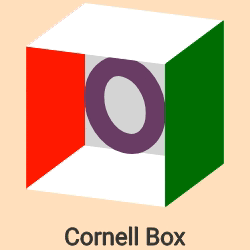

# Rdog 

This is a port of the [zdog](https://zzz.dog/) pseudo 3D engine for R.
Currently a work in progres.

## Installation

``` r
devtools::install_github('oganm/rdog')
```

Install the latest Rstudio to make sure it works well with the built in
viewer. Some elements appears to misbehave in older versions.

## Why?

…

## Basic usage

An animated illustration can be created by adding elements to an
illustration using `%>%`. Each shape can be added to the illustartion
itself (default), or to another existing shape which will be used as a
reference point. Here a box is created placed on `y = -20`. The next
element is an ellipse which is added to the box which places it in the
middle of the box.

To add text, a font should be added first. `zfont_font(id = 'font')`
creates one with the default font, “Roboto-Regular”. Different fonts can
be used if you have the `ttf` files.

Finally, animations are also added to elements or the entire
illustration. Here `animation_rotate` is added to the ellipse and
`animation_ease_in` is added to the box which makes them rotate at
different rates. `animation_none` will not move the objects but creates
the loop required for `dragRotate` to work.

``` r
illustration('illo',width = 250,height = 250, dragRotate = TRUE) %>% 
    shape_box(id ='cornell',
              width = 150,
              height = 150,
              depth = 150,
              translate = c(y = '-20'),
              rotate = c(x = -tau/20,y = tau/16),
              stroke = 1,
              color = '#C25',
              leftFace = 'red',
              rightFace =  'green',
              topFace =  'white',
              bottomFace =  'white',
              frontFace =  FALSE,
              rearFace= 'lightgray') %>% 
    shape_ellipse(
        addTo = 'cornell',
        id = "ellipse",
        diameter = 80,
        stroke = 20,
        color = '#636',fill = FALSE
    ) %>% 
    zfont_font(id = 'font') %>% 
    zfont_text(zfont = 'font', text = 'Cornell Box',fontSize = 24,translate = c(y = 120),textAlign = 'center') %>% 
    animation_rotate(addTo = 'ellipse',id = 'rotate',rotate = c(y = 0.05)) %>% 
    animation_ease_in(id = 'ease',radiansPerCycle = tau/2,addTo='cornell',framesPerCycle = 200,power = 3) %>% 
    record_gif(duration = 10)
```

<!-- -->

`record_gif` is not required for interactive usage or html renderings.
By default, the output is an htmlwidget, that can be automatically
displayed in the viewer. This doesn’t work with github\_document’s due
to restrictions on github so rendering into a gif is necesary.

## Rendering SVG paths

Paths from svg files can also be displayed.

``` r
# get an svg file
svgFile = system.file('swords-emblem.svg',package = 'rdog')
# parse the svg file
svg = XML::xmlParse(svgFile) %>% XML::xmlToList()
# extract path
path = svg$g$path['d']

# animate and record gif
illustration('illo',width = 256,height = 256, dragRotate = TRUE) %>%
    svg_path_to_shape(id = 'sword_shield',svgWidth = 512, svgHeight = 512,stroke = 1,svgPath = path,scale = .5,fill =TRUE,closed = FALSE)   %>% 
    animation_ease_in(framesPerCycle = 200,pause = 300, power = 30,rotateAxis = 'y') %>%
    record_gif(file = 'sword_shield.gif',duration = 7)
```

<!-- -->

## Use in shiny

rdog functions return a shiny widget which can be used in shiny
applications using `renderRdog` and `rdogOutput` functions. Below is a
basic app where radius of an ellipse is controlled by a `sliderInput`
and a spin animation can be triggered by pressing a button. Note that
`useShinyjs()` is required to trigger the animation in a separate code
block.

``` r
library(shiny)
devtools::load_all()
ui <- fluidPage(
    shinyjs::useShinyjs(),
    shiny::actionButton(inputId = 'anim',label = 'Animate'),
    shiny::sliderInput(min = 0, max = 140, inputId = 'slider',label = '',value = 80),
    rdogOutput('dogy',height = 240,width = 240)
)

server <- function(input, output) {
    output$dogy = renderRdog({
        illustration('illo',width = 250,height = 250,dragRotate = TRUE) %>%
            shape_box(id ='cornell',
                      width = 150,
                      height = 150,
                      depth = 150,
                      translate = c(y = '-20'),
                      rotate = c(x = -tau/20,y = tau/16),
                      stroke = 1,
                      color = '#C25',
                      leftFace = 'red',
                      rightFace =  'green',
                      topFace =  'white',
                      bottomFace =  'white',
                      frontFace =  FALSE,
                      rearFace= 'lightgray') %>%
            shape_ellipse(
                addTo = 'cornell',
                id = "ellipse",
                diameter = input$slider,
                stroke = 20,
                color = '#636',fill = FALSE
            ) %>%
            zfont_font(id = 'font') %>%
            zfont_text(zfont = 'font', text = 'Cornell Box',fontSize = 24,translate = c(y = 120),textAlign = 'center')  %>%
            animation_none(id = 'none')
            # animation_rotate(addTo = 'ellipse',id = 'rotate',rotate = c(y = 0.05)) %>%
            # animation_ease_in(id = 'ease',frames = Inf,radiansPerCycle = tau/2,addTo='cornell',framesPerCycle = 120,power = 3)
    })

    observe({
        print(input$anim)
        if(input$anim>0){
            animation_ease_in(id = 'ease',rdog = 'illo',frames = 120,radiansPerCycle = tau/2,addTo='cornell',framesPerCycle = 120,power = 3)
            # animation_rotate(id = 'rotate', rdog = 'illo',frames = 120, rotate = c(y = tau/120))
        }
    })

}

shinyApp(ui = ui, server = server)
```

## Use as shiny inputs

WIP
