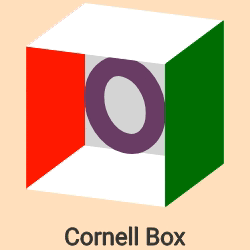
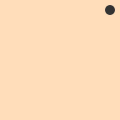
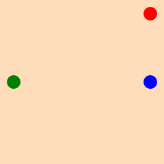
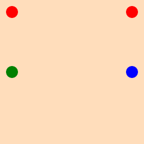
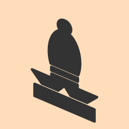
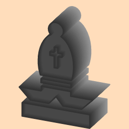
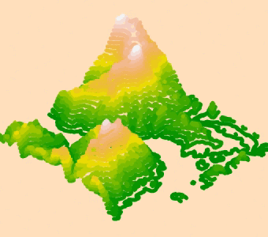
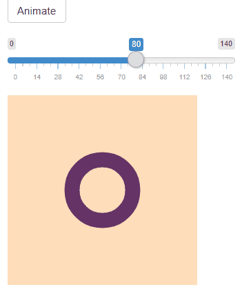
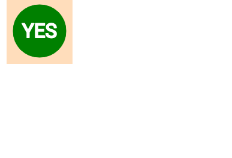

# Rdog 

This is a port of the [zdog](https://zzz.dog/) pseudo 3D engine for R.
Currently a work in progres.

## Installation

``` r
devtools::install_github('oganm/rdog')
```

Install the latest Rstudio to make sure it works well with the built in
viewer. Some elements appears to misbehave in older versions.

## Why?

As the zdog’s author states

> Zdog is a 3D JavaScript engine for canvas and SVG. With Zdog, you can
> design and render simple 3D models on the Web. Zdog is a pseudo-3D
> engine. Its geometries exist in 3D space, but are rendered as flat
> shapes. This makes Zdog special.

Can rdog make renderings that look better than
[rayshader](https://github.com/tylermorganwall/rayshader) or
[rayrender](https://github.com/tylermorganwall/rayrender)? No. We have
no perspective, no distance blurring, no lighting simulation, no
shadows. You have objects in a 3D space and they tend to look cute with
minimal effort. It has a nice natural aesthetic that I happen to like.

One advantage is that output of rdog is an htmlwidget and the rendering
is done through javascript objects by the browser. Images are rendered
into a canvas or an svg context. This is particularly nice for shiny
apps since rendering is outsourced to the users’ browser and the
rendered objects can be manipulated with relative ease through
javascript or wrapper functions provided in the package.

## Basic usage

Taking a look at the [zdog api](https://zzz.dog/api) will give you a
good idea how things work. Variable names and defaults are preserved.
The only major difference is the use of piping to create a single
illustration object with all the elements.

An animated illustration can be created by adding elements to an
illustration using `%>%`. Each shape can be added to the illustartion
itself (default), or to another existing shape which will be used as a
reference point. Here a box is created placed on `y = -20`. The next
element is an ellipse which is added to the box which places it in the
middle of the box. All shape functions start with `shape`

To add text, a font should be added first. `zfont_font(id = 'font')`
creates one with the default font, “Roboto-Regular”. Different fonts can
be used if you have the `ttf` files.

Finally, animations are also added to elements or the entire
illustration. Here `animation_rotate` is added to the ellipse and
`animation_ease_in` is added to the box which makes them rotate at
different rates. `animation_none` will not move the objects but creates
the loop required for `dragRotate` to work.

``` r
illustration('illo',width = 250,height = 250, dragRotate = TRUE) %>% 
    shape_box(id ='cornell',
              width = 150,
              height = 150,
              depth = 150,
              translate = c(y = '-20'),
              rotate = c(x = -tau/20,y = tau/16),
              stroke = 1,
              color = '#C25',
              leftFace = 'red',
              rightFace =  'green',
              topFace =  'white',
              bottomFace =  'white',
              frontFace =  FALSE,
              rearFace= 'lightgray') %>% 
    shape_ellipse(
        addTo = 'cornell',
        id = "ellipse",
        diameter = 80,
        stroke = 20,
        color = '#636',fill = FALSE
    ) %>% 
    zfont_font(id = 'font') %>% 
    zfont_text(zfont = 'font', text = 'Cornell Box',fontSize = 24,translate = c(y = 120),textAlign = 'center') %>% 
    animation_rotate(addTo = 'ellipse',id = 'rotate',rotate = c(y = 0.05)) %>% 
    animation_ease_in(id = 'ease',radiansPerCycle = tau/2,addTo='cornell',framesPerCycle = 200,power = 3) %>% 
    record_gif(duration = 10)
```

<!-- -->

`record_gif` is not required for interactive usage or html renderings.
By default, the output is an htmlwidget, that can be automatically
displayed in the viewer. This doesn’t work with github\_document’s due
to restrictions on github so rendering into a gif or an image
(`save_image`) is necesary.

`anchors` are invisible elements that one can add shapes to and be used
as a reference point.

``` r
illustration('illo') %>% 
  anchor(id ='anchor', translate = c(x = 100)) %>% 
  shape_shape(addTo = 'anchor', translate = c(y = - 100), stroke = 20) %>% 
  save_image()
```

<!-- -->

`copy` and `copyGraph` functions can be used to duplicate objects.
`copyGraph` will also copy any children object that an object has. You
can change properties of the object you copy by passing additional
arguments.

``` r
illustration('illo') %>% 
  shape_shape(id ='point1', translate = c(x = 100),stroke = 20, color = 'blue') %>% 
  shape_shape(addTo = 'point1', translate = c(y = - 100), stroke = 20, color = 'red') %>%
  copy(id = 'copyOfPoint1', what = 'point1',color = 'green',translate = c(x = -100)) %>%
  save_image()
```

<!-- -->

``` r
illustration('illo') %>% 
  shape_shape(id ='point1', translate = c(x = 100),stroke = 20, color = 'blue') %>% 
  shape_shape(addTo = 'point1', translate = c(y = - 100), stroke = 20, color = 'red') %>%
  copyGraph(id = 'copyOfPoint1', what = 'point1',color = 'green',translate = c(x = -100)) %>%
  save_image()
```

<!-- -->

## Rendering SVG paths

Paths from svg files can also be displayed.

``` r
# get an svg file
svgFile = system.file('chess-bishop.svg',package = 'rdog')
# parse the svg file
svg = XML::xmlParse(svgFile) %>% XML::xmlToList()
# extract path
path = svg$g$path['d']

# animate and record gif
illustration('illo',width = 256,height = 256) %>%
    svg_path_to_shape(svgWidth = 512, svgHeight = 512,stroke = 1,svgPath = path,scale = .7,fill =FALSE,closed = FALSE)   %>% 
    save_image()
```

<!-- -->

`stroke` variable can be used to give some depth to svg
paths.

``` r
illustration('illo',width = 256,height = 256, rotate = c(y =tau/10, x = -tau/10)) %>%
    svg_path_to_shape(svgWidth = 512, svgHeight = 512,stroke =5,svgPath = path,scale = .7,fill =FALSE,closed = FALSE)   %>% 
    save_image()
```

<!-- -->

Note that setting `fill = TRUE` will cause you to lose enclosed shapes
in an svg
path

``` r
illustration('illo',width = 256,height = 256, rotate = c(y =tau/10, x = -tau/10)) %>%
    svg_path_to_shape(svgWidth = 512, svgHeight = 512,stroke =5,svgPath = path,scale = .7,fill =TRUE,closed = FALSE)   %>% 
    save_image()
```

<!-- -->

But some fiddling can still generate a decent looking 3D
structure

``` r
rd = illustration('illo',width = 256,height = 256 ,rotate = c(y =tau/15, x = -tau/15))
colfunc <- colorRampPalette(c("gray60","gray20"))

zAxis = seq(from = -25, to=25 ,by = 1)
for(i in seq_along(zAxis)){
    rd %<>%
        svg_path_to_shape(svgWidth = 512,svgHeight = 512,
                          translate = c(z = zAxis[i]),color = colfunc(length(zAxis))[i],
                          stroke = 2,svgPath = path,scale = .7,fill =FALSE,closed = FALSE)
}

zAxis2 = seq(from = -15, to=15 ,by = 1)
for(i in seq_along(zAxis2)){
    rd %<>%
        svg_path_to_shape(svgWidth = 512,svgHeight = 512,
                          translate = c(z = zAxis2[i]),color = colfunc(length(zAxis))[zAxis %in% zAxis2[i]],
                          stroke = 2,svgPath = path,scale = .7,fill =TRUE,closed = FALSE)
}

rd %>% save_image()
```

<!-- -->

## Rendering maps

rdog’s probably not the best tool for this but here’s a contour based
visualization. Note that individual contours are split into smaller
pieces and added as shapes. Otherwise long contours tend to have weird
z-fighting and become visible when they shouldn’t. Having less shapes is
better for the frame rate though so the increasing the `groupBy`
variable in the code below will be good for performance.

I also use `subsample` to get rid of a portion of contour points to make
is easier to render and with the stroke volume, it doesn’t drastically
change how the map looks.

Note that for this type of rendering, you definetaly don’t want to use
an SVG context if you want any animation. Having this many objects in an
SVG really slows things down.

``` r
# get the elevation data
loadzip = tempfile()
download.file("https://tylermw.com/data/dem_01.tif.zip", loadzip)
localtif = raster::raster(unzip(loadzip, "dem_01.tif"))
unlink(loadzip)

#And convert it to a matrix:
elmat = matrix(raster::extract(localtif, raster::extent(localtif), buffer = 1000),
               nrow = ncol(localtif), ncol = nrow(localtif))

# scale values to be between -50 and 50 to match the z coordinates they'll get
elmat %<>% scaleToInt(-50,50)
contours = contourLines(z = elmat, nlevels = 30)

# get contour levels
levels = contours %>% purrr::map_dbl('level') %>% unique
# get the difference between contour levels to set the stroke volume
levelDif = levels[2] - levels[1]

# empty illustration with a group to control the contours
rdog = illustration('illo',width = 340,height = 300, dragRotate = TRUE, rotate = c( y= tau/8, x = -tau/10)) %>%
    group('contours',updateSort = TRUE)

subsample = 8
groupBy = 32

colors = terrain.colors(length(levels))

for(i in seq_along(contours)){
    level =contours[[i]]$level
    color = colors[levels== level]
    path = seq_along(contours[[i]]$x) %>% lapply(function(j){
        c(z = contours[[i]]$y[j]* 250 -125, x = contours[[i]]$x[j] * 250 - 125, y = -level)
    })
    
    # get rid of a portion of points for better frame rate
    path = path[unique(c(seq(from = 1, to = length(path), by = subsample), length(path)))]
    
    
    # split the contour into multiple shapes to help with z-fighting
    for(j in unique(seq(from = 1, to = length(path), by = groupBy), length(path))[-length(path)]){
        rdog %<>% shape_shape(
            stroke = levelDif,
            color = color,
            closed = FALSE,
            fill = FALSE,
            addTo = 'contours',
            path = path[j:(min(j+groupBy,length(path)))]
        )
    }
    
}

rdog %>%
    animation_rotate(rotate = c(y = .01)) %>% 
    record_gif(duration = 12, file = 'elmat.gif')
```



## Use in shiny

rdog functions return a shiny widget which can be used in shiny
applications using `renderRdog` and `rdogOutput` functions. Below is a
basic app where radius of an ellipse is controlled by a `sliderInput`
and a spin animation can be triggered by pressing a button. This is done
by a `animation_ease_in` command with a finite number of frames getting
triggered by an `observe` code block. Any rdog command can be decoupled
from the `renderRdog` command block so you can modify individual
elements of the of the illustration without re-creating the whole thing.

Note that `useShinyjs()` command in the UI is required for decoupled
commands to work. I know I should have used something like
`session$sendCustomMessage` but this was easier for now. This
requirement may be removed later.

``` r
library(shiny)
devtools::load_all()
ui <- fluidPage(
    shinyjs::useShinyjs(),
    shiny::actionButton(inputId = 'anim',label = 'Animate'),
    shiny::sliderInput(min = 0, max = 140, inputId = 'slider',label = '',value = 80),
    rdogOutput('dogy',height = 240,width = 240)
)

server <- function(input, output) {
    output$dogy = renderRdog({
        illustration('illo',width = 250,height = 250,dragRotate = TRUE) %>%
            shape_ellipse(
                addTo = 'illo',
                id = "ellipse",
                diameter = 80,
                stroke = 20,
                color = '#636',fill = FALSE
            ) %>%
            animation_none(id = 'none')
    })
    
    observe({
        print(input$anim)
        if(input$anim>0){
            animation_ease_in(id = 'ease',rdog = 'illo',frames = 120,radiansPerCycle = tau/2,addTo='illo',framesPerCycle = 120,power = 3)
        }
    })
    
    observe({
        print(input$slider)
        updateProperty(rdog = 'illo',elementId = 'ellipse', diameter = input$slider)
    })
    
}

shinyApp(ui = ui, server = server)
```



Note that in the example above, the diameter control did not have to
have it’s own `observe` block. We could have set `diameter =
input$slider` within the `renderRdog` function as well. However, this
would have caused the entire illustration to be re-created at each
manipulation of the slider. Not great for performance

## Use as shiny inputs

Illustartions can be used as shiny inputs. At each mouse click at an
illustration `input$illustrationId` will be set to a list that contains
`x` and `y` coordinates of the mouse relative to the canvas, along with
a random `nonce` value to force trigger updates. This allows you to use
rdog illustrations as buttons or make them interactive. A list of all
active animations is also returned in the input which allows one to
avoid triggering the same animation multiple times.

``` r
library(shiny)
devtools::load_all()
ui <- fluidPage(
    shinyjs::useShinyjs(),
    rdogOutput('check',height = 100,width = 100),
    verbatimTextOutput('textOut')
)

server <- function(input, output) {
    output$check = renderRdog({
        illustration('illo',height = 100, width = 100,dragRotate = FALSE) %>% 
            shape_ellipse(diameter = 80, color = 'green', backface = 'red') %>% 
            zfont_font(id= 'font') %>% 
            zfont_text(zfont = 'font', text = "YES",color = 'white',textAlign = 'center',fontSize = 30,translate = c(z = 20, y = 10),stroke = 2) %>% 
            zfont_text(zfont = 'font', text = "NO",color = 'white',textAlign = 'center',fontSize = 30,rotate = c(y = pi),translate = c(z = -20, y = 10),stroke = 2)
        
    })
    
    output$textOut = renderText({
        
        if(!is.null(input$check)){
            if(is.null(input$check$animations$ease) || input$check$animations$ease == 0){
                animation_ease_in(id = 'ease',rdog = 'illo',frames = 120,radiansPerCycle = tau/2,addTo='illo',framesPerCycle = 120,power = 3)
            }
            paste("x: ",input$check$x,'y:', input$check$y) 
        }
    })
}
shinyApp(ui = ui, server = server)
```


